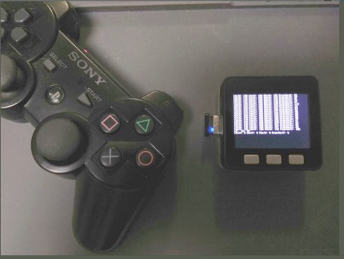

# M5Stack_USBHost_PS3BT

M5Stack and USB_Host_shield(MAX3421E) demo.
PS3 controller is connected through BT dongle and data is displayed on M5Stack screen.

## How to use PS3 Controller with BT connection

To use with BT connection, you need to write the MAC address of the Bluetooth dongle to the PS3 controller.

1. Upload scketch to M5Stack

2. Insert the Bluetooth dongle in the USB host connector and turn on the power.

3. Unplug the Bluetooth dongle without turning off the power, and connect the PS3 controller with a USB cable.

4. Unplug the PS3 controller and insert the Bluetooth dongle again.

5. Reset M5Stack and press the PS button on the PS3 controller.

6. If the LED of the PS3 controller blinks for a while and it stoped, it is connected successfully .

### USB Host Shield
https://thousandiy.wordpress.com/2016/03/27/usb-host-shield-for-pro-mini/

### USB Host Shield Library
https://github.com/felis/USB_Host_Shield_2.0
